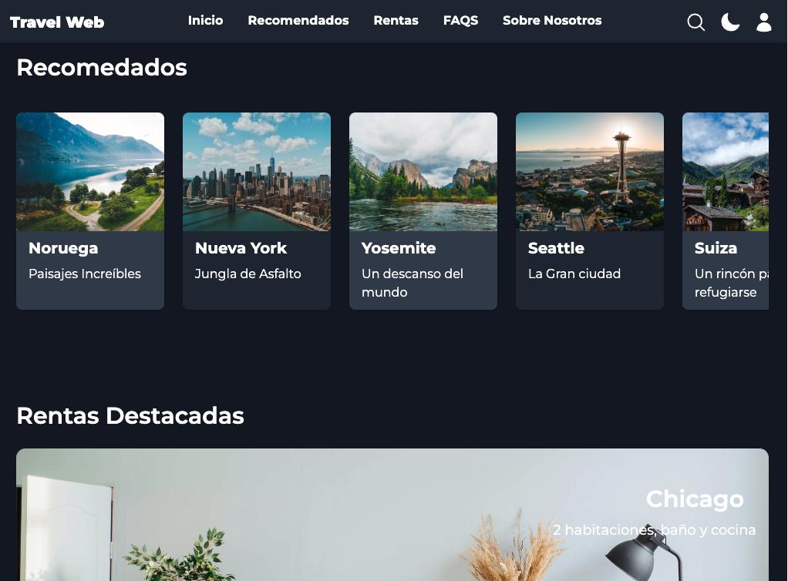

# Travel Web Proyect

Este proyecto consiste en una web de viajes en la que se ha trabajado Tailwind para hacer todos los estilos de Css.
En él se pueden ver varias secciones donde podemos buscar diferentes estancias, las más destacadas y otros como FAQS.
También se ha incluido un dark mode, es totalmente responsive y como punto adiccional se ha implementado el acceso a un login de usuario.

## Imagenes

;
;
;

## Herramientas

-Tailwind
-Html
-Javascript

## Autor

Cris Muñiz